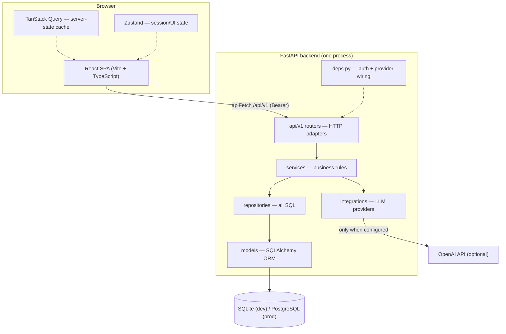
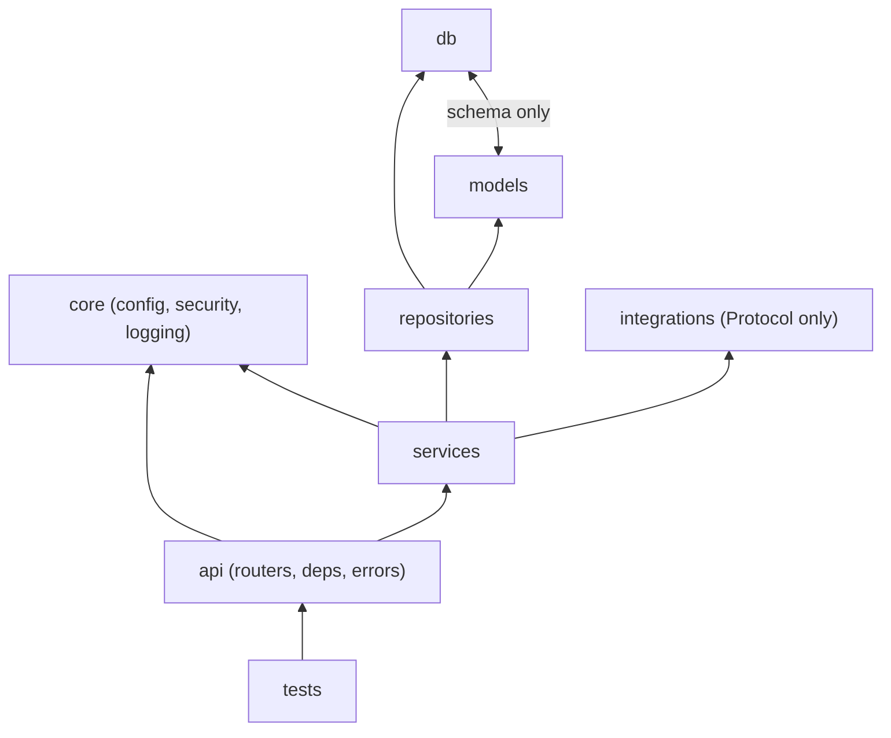
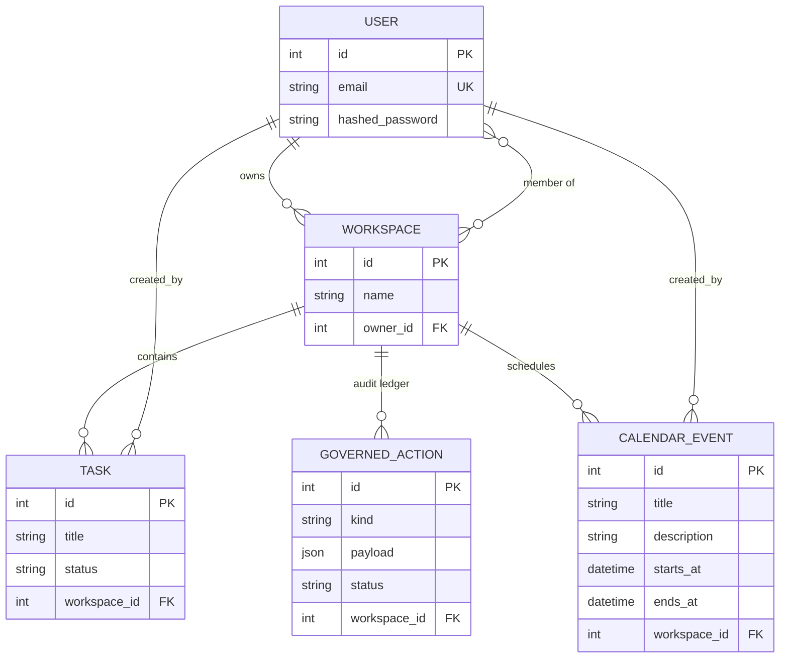
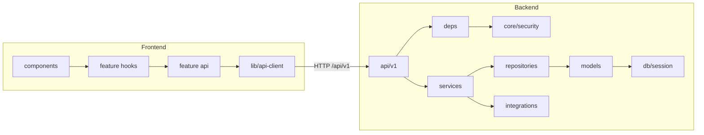

# NexusAI — Architecture Map

> **How to read this document.** Every folder is presented the same way:
> *why it exists* → *what belongs there* → *what must never go there*. The
> "never" lists are not bureaucracy — they are the boundaries that keep a
> codebase reviewable when ten people edit it at once. When a reviewer asks
> "why is this code here?", this document answers before they have to.

---

## 1. System overview



One process, one database, one HTTP doorway per side. Nothing here needs a
message queue, microservices, or Kubernetes — those would add failure modes
faster than they add value at this size.

---

## 2. The one dependency rule

Dependencies point **inward/downward only**. A layer knows the layers below
it and is ignorant of the layers above.



| From ↓ may import → | core | db | models | repositories | services | integrations | api |
|---|---|---|---|---|---|---|---|
| **api** | ✅ | ✅ | ✅ | ❌ | ✅ | ✅ (Protocol) | — |
| **services** | ✅ | ✅ | ✅ | ✅ | ✅ | ✅ (Protocol) | ❌ |
| **repositories** | ❌ | ✅ | ✅ | — | ❌ | ❌ | ❌ |
| **models** | ❌ | ✅ | — | ❌ | ❌ | ❌ | ❌ |
| **integrations** | ✅ | ❌ | ❌ | ❌ | ❌ | — | ❌ |

The consequences of this table are what reviewers enforce:

- **Services never see HTTP.** No `HTTPException`, no `Request` — so business
  rules are testable without a web server.
- **Repositories never make decisions.** They fetch and persist; they never
  decide who may do what.
- **Services depend on the LLM *Protocol*, not a vendor SDK.** Swapping OpenAI
  for anything else touches one factory file (`integrations/factory.py`).
- **Models never know how connections are made** (`db/base.py` is separate
  from `db/session.py` for exactly this reason).

---

## 3. Backend folders (`backend/app/`)

### `api/` — the HTTP boundary

**Why it exists:** the one place that speaks HTTP. It translates requests
into service calls and service results into responses. Versioned as
`api/v1/` so breaking changes get a `v2` namespace instead of silently
breaking clients.

**What belongs:** routers (parse → call service → map errors → respond),
`deps.py` (dependency wiring: current user, DB session, LLM provider),
`errors.py` (the single domain-exception → status-code table).

**What never belongs:** business rules, SQL, ORM objects in responses
(`schemas/` DTOs only), loops that decide *who may do what* — if you write
such a check here, move it to a service.

### `services/` — the brain

**Why it exists:** business rules need a home that is neither HTTP-shaped
(routers) nor database-shaped (repositories). Services own transactions:
they authorize, orchestrate repositories, and commit once per operation.

**What belongs:** authorization checks (`_require_member`), orchestration
(`ActionService.approve` executing a deletion atomically), domain errors
(`errors.py`), units of work.

**What never belongs:** `Request`/`Response` objects, JSON, HTTP status
codes, raw SQL, vendor SDKs.

### `repositories/` — data access

**Why it exists:** every query in the application lives in exactly one
place. When a query needs an index or a rewrite, there is one file to fix;
when a reviewer wants to know what data a feature touches, the repository
file is the inventory.

**What belongs:** queries, `add`/`get`/`delete` persistence (flush, never
commit), aggregate-specific finders (`TaskRepository.list_for_workspace`).

**What never belongs:** authorization, business decisions, commits (the
service commits), HTTP concepts.

### `models/` — the database shape

**Why it exists:** ORM models are the single source of truth for the schema;
Alembic diffs against them to generate migrations.

**What belongs:** SQLAlchemy models, `StrEnum` status types, the
`workspace_members` tenancy table. Imported once in `models/__init__.py` so
Alembic sees everything.

**What never belongs:** business logic, Pydantic schemas, HTTP concepts.

### `schemas/` — the API contracts

**Why it exists:** the request/response DTOs are the public contract of the
API. They validate input at the boundary (`Field(min_length=1)`,
regex-constrained `kind`) and guarantee ORM internals never leak
(`UserOut` has no `hashed_password` — enforced by a test).

**What belongs:** Pydantic models, `from_attributes` output DTOs, field
constraints.

**What never belongs:** ORM models, business rules.

### `core/` — cross-cutting concerns

**Why it exists:** configuration, security primitives, and logging are
needed by everyone and owned by no feature. One file each, so a change is
auditable.

**What belongs:** `config.py` (all settings, `NEXUSAI_`-prefixed env vars —
no `os.environ` anywhere else), `security.py` (the *only* code that knows
how passwords are hashed or JWTs signed), `logging.py`.

**What never belongs:** feature logic, imports from any higher layer.

### `db/` — persistence plumbing

**Why it exists:** engine/session lifecycle must be explicit and singular.

**What belongs:** `base.py` (DeclarativeBase — deliberately separate so
models don't import the engine), `session.py` (engine, `SessionLocal`,
`get_db` dependency with guaranteed cleanup).

**What never belongs:** queries, business logic.

### `integrations/` — the outside world

**Why it exists:** third-party SDKs and external HTTP calls are a volatility
source. They get a quarantine zone. `base.py` defines the `LLMProvider`
Protocol; `factory.py` maps configuration to a concrete provider.

**What belongs:** vendor adapters (`openai_provider.py`), the deterministic
`mock_provider.py`, the Protocol, the factory.

**What never belongs:** business rules, database access. If a vendor changes
its API contract, only this folder may need edits.

### `backend/tests/` + `backend/alembic/`

**tests:** mirror the flows, not the file structure — one test file per
domain flow (auth, tasks, actions, assistant, workspaces). Only `get_db` is
overridden; everything else is real wiring, so tests catch dependency bugs
unit tests would miss.

**alembic:** schema migrations. `env.py` reads the URL from app settings —
one configuration source of truth. **Never edit an applied migration; add a
new revision.** Never ship `Base.metadata.create_all` as a migration
strategy.

---

## 4. Frontend folders (`frontend/src/`)

### `features/<feature>/` — vertical slices

**Why it exists:** features are sliced **vertically** (their own api, hooks,
components) instead of horizontally (all components in one folder, all hooks
in another). A feature can be understood, reviewed, and deleted as a unit —
and two people adding different features rarely touch the same files.

**What belongs:** inside each feature — `api/` (typed endpoint adapters that
go through `apiFetch`), `hooks/` (TanStack Query logic: reads + writes with
optimistic updates), `components/` (that feature's UI only).

**What never belongs:** another feature's internals, global state, raw
`fetch()` calls, business rules the backend should own.

Current features: `auth`, `workspaces`, `tasks`, `actions`, `assistant`, `calendar`.

### `lib/` — infrastructure, not features

**Why it exists:** exactly one HTTP doorway (`api-client.ts`) owning base
URL, auth headers, error normalization, and the 401 → refresh → retry
recovery; one query client with cache conventions.

**What belongs:** `api-client.ts`, `query-client.ts`, generic utilities.

**What never belongs:** anything feature-specific, UI components.

### `stores/` — client-owned state only

**Why it exists:** Zustand holds what the *client* owns: the in-memory
session. The crucial distinction it encodes: **server data is a cache, not
state** — it lives in TanStack Query, and duplicating it into Zustand is how
apps rot into inconsistency.

**What belongs:** `auth-store.ts` (user + access token, memory only),
genuine UI preferences.

**What never belongs:** API responses, anything refreshable by a query.

### `components/` — shared primitives

**Why it exists:** layout and route guards used by every feature.

**What belongs:** `Layout.tsx`, `ProtectedLayout.tsx` (the single
"authenticated?" decision point), generic UI primitives.

**What never belongs:** feature logic, API calls.

---

## 5. Database architecture



Design decisions worth internalizing:

- **The workspace is the tenancy boundary.** Every task and action carries
  `workspace_id`, and *every* service method starts with a membership check.
  Tenancy is a service-level invariant, not a database trick.
- **`governed_actions` is an append-style audit ledger.** Deleting a task is
  impossible directly — it must exist as a proposed, decided, executed row.
  The database *is* the approval history.
- **SQLite in dev, PostgreSQL in prod** — one `DATABASE_URL` away because no
  query uses vendor-specific SQL. `native_enum=False` and
  `render_as_batch=True` keep the SQLite→PG path smooth.
- **Schema changes = Alembic revisions.** Autogenerated, reviewed like code,
  applied in CI/deployment — never hand-edited after the fact.

---

## 6. Authentication architecture

```mermaid
sequenceDiagram
    participant FE as SPA (memory)
    participant API as FastAPI
    participant DB as Database

    FE->>API: POST /auth/login (email, password)
    API->>DB: verify bcrypt hash
    API-->>FE: access_token (15 min)
    API-->>FE: Set-Cookie: nexusai_refresh (httpOnly, path-scoped)
    Note over FE: token lives in Zustand — memory ONLY
    FE->>API: GET /tasks (Authorization: Bearer ...)
    API-->>FE: 200
    Note over FE: 15 minutes pass — access token expired
    FE->>API: GET /tasks (Bearer expired)
    API-->>FE: 401
    FE->>API: POST /auth/refresh (cookie rides along; JS cannot read it)
    API-->>FE: new access_token + rotated refresh cookie
    FE->>API: GET /tasks (Bearer fresh) — automatic single retry
    API-->>FE: 200
```

The security reasoning, in one paragraph per decision:

- **Access token in memory, never localStorage** — XSS can execute with what
  it can steal; it cannot read an `httpOnly` cookie.
- **Refresh token in an `httpOnly`, path-scoped cookie** — only ever sent to
  `/api/v1/auth`, and rotated on every refresh so a stolen token dies fast.
- **Single-flight refresh** (`api-client.ts`) — twenty parallel 401s trigger
  exactly one refresh call, then one retry each. This is a tested behavior,
  not an aspiration (`src/lib/api-client.test.ts`).
- **Passwords** — bcrypt via `core/security.py`, the only hashing-aware file.
- **Registration** — creates the user *and* their personal workspace in one
  transaction, so tenancy exists from minute one.

---

## 7. State management — server state vs. client state

| | TanStack Query | Zustand |
|---|---|---|
| **Owns** | anything the server could answer | what the client truly owns |
| **Examples** | tasks, workspaces, actions, answers | session user, access token |
| **Lives** | `features/*/hooks` + `lib/query-client.ts` | `stores/` |
| **Invalidated by** | `invalidateQueries` after writes | explicit actions (login/logout) |
| **Rot smell** | duplicating query data into a store | putting API responses in a store |

If a piece of state is derivable from a query, it must not exist in Zustand.

---

## 8. API flow conventions

- Prefix `/api/v1` — a versioned namespace, not decoration.
- Routers: parse → service → `except (NotFoundError, PermissionDeniedError,
  BusinessRuleError): raise http_error_for(exc)`. Consistent 404/403/409
  mapping lives in `api/errors.py`.
- Error details are stable machine strings (`"not_a_workspace_member"`) the
  frontend can branch on.
- Dev proxying: Vite forwards `/api` to `:8000` (`vite.config.ts`), so the
  SPA is same-origin in development *and* production. CORS exists in config
  but is normally unnecessary.

---

## 9. Dependency graph (what actually imports what)



---

## 10. Anti-pattern watchlist (how this architecture dies)

Each of these starts small and feels harmless. Reviewers reject them early:

1. **"Just this once" SQL in a service or router** — breaks the one-doorway
   data rule; the query inventory lies from then on.
2. **A global `components/` folder that swallows features** — horizontal
   slicing returns; two people editing one giant folder collide.
3. **Storing query results in Zustand "for convenience"** — two sources of
   truth; the UI disagrees with itself.
4. **`localStorage.setItem("token", ...)`** — undoes the cookie design.
5. **Business rules creeping into routers** — untestable without HTTP.
6. **Editing an applied migration** — teammates' databases diverge silently.
7. **Importing a vendor SDK outside `integrations/`** — lock-in spreads past
   the quarantine.
8. **A second API client** — auth handling forks; one fork forgets the
   refresh flow.

When a PR crosses one of these lines, the review conversation is not about
style — it is about this document.


