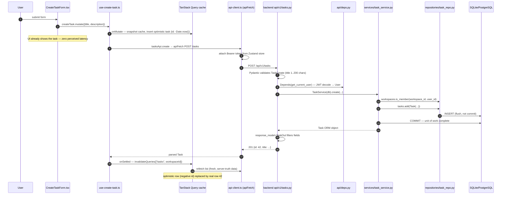
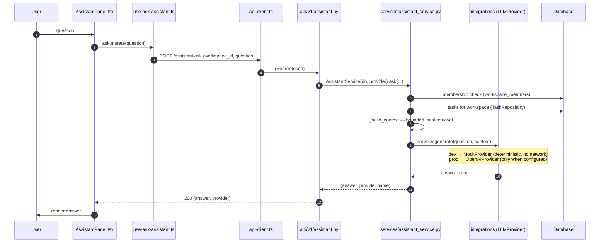
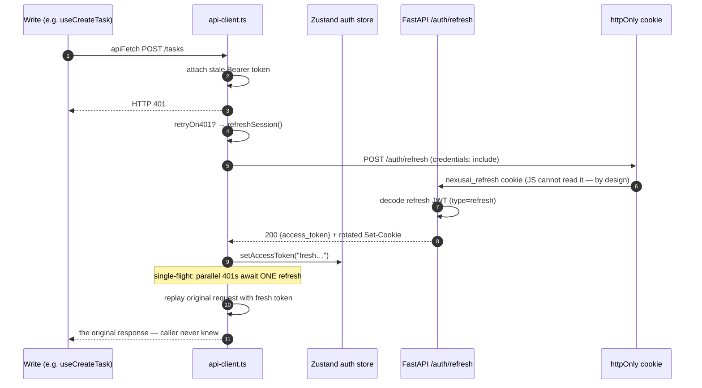
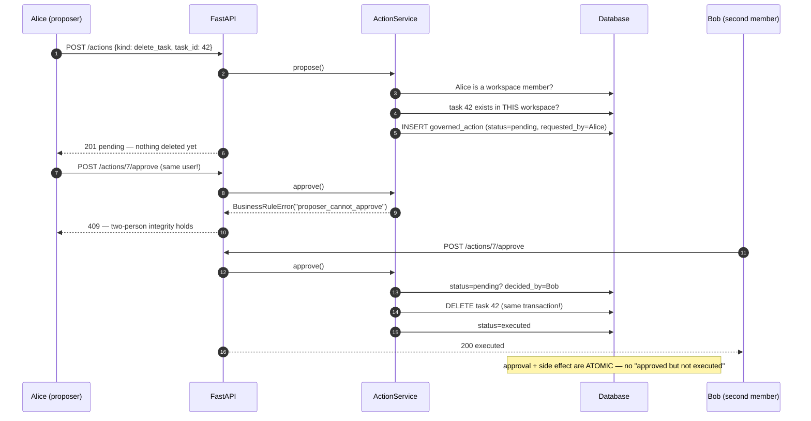

# NexusAI — Request Flow

> Four complete traces through the real code. File paths are clickable from
> the repo root. If you internalize these four paths, you can trace *any*
> request in this codebase — because every request is a variation of one of
> them: **a write**, **a read**, **a recovery**, and **a governed operation**.

---

## Trace 1 — Creating a task (the write path, with optimistic UI)

*The user types "Write architecture docs" and presses Add task.*

Why each layer exists, in the order the request meets it:

| Hop | File | Responsibility | What would go wrong without it |
|---|---|---|---|
| 1 | `frontend/src/features/tasks/components/CreateTaskForm.tsx` | form state, validation UX | UI logic mixed with I/O |
| 2 | `frontend/src/features/tasks/hooks/use-create-task.ts` | owns the write *strategy*: optimistic update, rollback, invalidation | every component re-implementing cache logic |
| 3 | `frontend/src/lib/api-client.ts` | the only `fetch`: auth header, error shape, 401 recovery | auth logic scattered across 20 files |
| 4 | `backend/app/api/v1/tasks.py` | HTTP parse + error mapping | business rules stuck to HTTP status codes |
| 5 | `backend/app/api/deps.py` | "who is calling?" — JWT → `User` | auth checks re-written per endpoint |
| 6 | `backend/app/schemas/task.py` | boundary validation; ORM never leaks | internal fields (e.g. hashes) escaping |
| 7 | `backend/app/services/task_service.py` | authorize → mutate → commit | rules untestable without HTTP |
| 8 | `backend/app/repositories/task_repo.py` | the only place SQL exists | queries impossible to find or optimize |
| 9 | `backend/app/models/task.py` | row shape | schema drift between code and database |

**The negative id convention:** the optimistic row gets `id: -Date.now()`
so you can always tell "not yet persisted" from real data, and React keys
never collide mid-flight.

---

## Trace 2 — Asking the assistant (the integration path)

*The user types "What is on my plate?" in the assistant panel.*

The teaching point is the **seam at step 8**: `AssistantService` receives
*anything with a `.generate()` method* (a `Protocol`, duck-typed). The router
gets it from `Depends(get_llm_provider)` → `factory.build_llm_provider()`.

- In tests and dev, the provider is `MockProvider` — deterministic, offline,
  and honest about it (`[mock]` prefix in every answer).
- In production, flipping `NEXUSAI_LLM_PROVIDER=openai` changes *nothing
  else* — no service, router, or test edits. That is dependency inversion,
  and it is what makes AI code testable at all.

Privacy note: in mock mode, data never leaves the process. In OpenAI mode,
the context (task titles/descriptions) does — a boundary worth knowing
exactly where it sits.

---

## Trace 3 — The 401 recovery (the resilience path)

*The access token expired 15 minutes ago; the user is still working.*

Failure branch: if the refresh call *also* 401s (cookie expired/revoked),
`apiFetch` calls `authStore.clear()` → `ProtectedLayout` redirects to
`/login`. The user re-authenticates; nothing else breaks.

Both branches are **proven**, not hoped: `src/lib/api-client.test.ts`
asserts the happy path (3 calls: original, refresh, replay) and the failure
path (session cleared, `ApiError` raised).

---

## Trace 4 — Deleting a task (the governed path)

*The user clicks "Propose delete" — and cannot destroy anything alone.*

Three governance rules, each enforced in `services/action_service.py` and
each pinned by a test in `tests/test_actions.py`:

1. **The proposer can never approve their own action** (409
   `proposer_cannot_approve`).
2. **The proposer may reject (withdraw) their own action** — withdrawal is
   not self-approval.
3. **Decision and execution share one transaction** — the ledger can never
   claim an approval whose effect silently failed.

There is deliberately **no `DELETE /tasks/{id}` endpoint**. When someone
asks for one, the answer is: "delete is a governed action — that's the
point."

---

## Reading errors by layer (debugging map)

| Symptom | Layer to inspect first | Why |
|---|---|---|
| `422` on a request | `app/schemas/` | validation is the boundary's job |
| `401` in the browser | `api-client.ts` → refresh flow | token lifecycle is client-side |
| `403 not_a_workspace_member` | `app/services/*_service.py` | tenancy checks live in services |
| `409` with a rule name | `app/services/errors.py` + caller | business rules raise `BusinessRuleError` |
| `500` | server logs → the service call stack | routers only translate; the bug is deeper |
| UI shows stale data | the write hook's `onSettled` invalidation | cache keys: `["tasks", workspaceId]` |
| Optimistic row stuck | `use-create-task.ts` onError rollback | negative `id` means "never confirmed" |
| Migration missing a column | `alembic/versions/` — did you autogenerate? | models changed without a revision |

The pattern to notice: **errors surface at the layer that owns the
invariant**. Validation errors at the schema, authorization errors in the
service, session errors in the API client. When debugging starts at the
right layer, half the work is done.

---

## One sentence per layer (memorize these)

- **Component** — render state, collect intent. *(no I/O)*
- **Hook** — own the caching/write strategy for one concern. *(no JSX)*
- **api-client** — the only `fetch`, and the only session-recovery logic.
- **Router** — HTTP in, service call, error translation. *(no rules)*
- **Dependency** — build what the request needs (session, user, provider).
- **Service** — authorize, orchestrate, commit. *(no HTTP, no SQL)*
- **Repository** — the only SQL. *(no decisions)*
- **Model** — the row. *(no behavior)*
- **Integration** — the only vendor SDK. *(no rules)*

