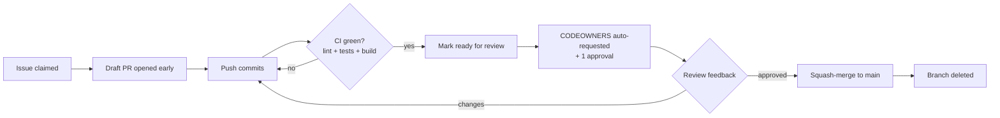

# NexusAI — Team Workflow

> The operating manual for collaborating on this repository: branching, PRs,
> reviews, and merges. Every rule here exists because it prevents a specific,
> observed failure mode — not for ceremony. `CONTRIBUTING.md` is the short
> version for newcomers; this is the full policy.

---

## 1. Branch naming

```
<type>/<issue#>-<short-kebab-name>
```

| Type | Use for | Example |
|---|---|---|
| `feature/` | user-visible additions | `feature/12-task-assignees` |
| `fix/` | bug fixes | `fix/17-refresh-cookie-path` |
| `docs/` | documentation only | `docs/architecture-map` |
| `refactor/` | no behavior change | `refactor/23-extract-action-service` |
| `chore/` | tooling, CI, dependencies | `chore/5-pin-ruff-version` |

Rules:

- Branch from **`main`**; keep one purpose per branch.
- The issue number in the name links work to discussion without opening the
  issue. `Closes #17` in the PR body does the actual linking.
- Delete branches after merge — `main` is history, not a graveyard.

## 2. Commit convention

Conventional Commits, lowercase, imperative:

```
feat(tasks): add assignee field to task creation
fix(auth): rotate refresh cookie on /auth/refresh
docs: document the governed-action flow
refactor(actions): extract proposer check into service
chore(ci): cache pip downloads
```

Why: `feat(...)` and `fix(...)` scopes make changelogs and release notes
mechanical, and reviewers can skim a branch's history to see its shape.

---

## 3. Pull request process



The non-negotiables:

1. **Open a draft PR early** — while still coding. It broadcasts intent,
   invites early design feedback (cheap), and prevents the "surprise 900-line
   PR" (expensive).
2. **CI must pass before review.** Reviews spend attention on design, not on
   "does it compile."
3. **Fill in the PR template** — especially *"How was this verified?"* An
   honest "I clicked through these three flows" beats a checked box with
   nothing behind it.
4. **Size discipline:** aim under ~400 changed lines. Bigger PRs get
   statistically shallower reviews. Split by layer: models+migration first,
   then service, then router, then UI — they stack as separate reviewable
   PRs.
5. **One approval minimum** (CODEOWNERS notifies the right person
   automatically). The author never merges their own PR.

---

## 4. Review checklist

Work top-down; the first items catch 90% of real problems.

### Architecture (the fast rejects)

- [ ] Business logic is in a **service** — no rules in routers/components
- [ ] All data access through **repositories** — no SQL anywhere else
- [ ] API changes go through **schemas/** with validation — ORM objects
      never leak into responses
- [ ] Frontend I/O goes through **`apiFetch`** — no raw `fetch`
- [ ] Server state in **TanStack Query**; Zustand untouched by API responses
- [ ] Vendor SDKs appear only under **`integrations/`**
- [ ] Any applied **migration** is a new Alembic revision, not an edit
- [ ] `docs/ARCHITECTURE_MAP.md` updated if a boundary moved

### Correctness & tests

- [ ] New behavior has a test that would fail without it
- [ ] Permission changes include a **negative test** (outsider denied — see
      `test_tasks.py::test_outsider_cannot_create_task` as the model)
- [ ] Optimistic updates have rollback + invalidation (`use-create-task.ts`
      is the reference pattern)
- [ ] Error cases return stable machine strings (`not_a_workspace_member`)

### Security

- [ ] No secrets/keys/URLs-with-credentials in code or logs (`.env` only)
- [ ] New endpoints require `get_current_user` *and* a tenancy check —
      unless there is a written reason not to
- [ ] No token ever placed in `localStorage` or a URL

### Readability

- [ ] Names say what the thing *is* (services: verbs for operations)
- [ ] Comments explain **why**, not what
- [ ] Public functions have a docstring only when the why is non-obvious

**Review etiquette:** questions, not commands ("What happens if the
workspace is empty here?"); approve with minor nits by default; request
changes only for the checklist above or real defects. Reviews are a
conversation between people who both want `main` to stay healthy.

---

## 5. Merge policy

| Rule | Value | Reason |
|---|---|---|
| Strategy | **Squash merge** | One logical change = one commit; revert is trivial |
| Commit message | PR title + `(#N)` | Clean, greppable `main` history |
| Required checks | CI (backend + frontend) green | No discussion, no exceptions |
| Reviews | ≥1 approval, author may not merge | Second pair of eyes on every line |
| Branch protection | `main`: no direct pushes, no force pushes | History is load-bearing for everyone |
| After merge | Delete branch, close linked issue automatically | Hygiene |
| Releases | Tag `v0.x.y` from `main` when deploying | Deployment = tagged commit, always |

**Hotfixes:** branch `fix/...` from `main`, same PR flow (fast-track review
is fine — skipping review is not).

---

## 6. A new teammate's first hour

```bash
git clone https://github.com/3punch/NexusAI.git
cd NexusAI
cp .env.example .env
docker compose up --build        # or the two-terminal setup in README
```

1. Register two accounts in two browsers — **propose** a task deletion with
   one, **approve** it with the other. You have now touched the governed
   action flow, the auth flow, and the tenancy checks.
2. Read `docs/REQUEST_FLOW.md` Trace 1 and open the named files alongside it.
3. Read `docs/ARCHITECTURE_MAP.md` §2 (the dependency rule) and §10 (the
   anti-pattern watchlist).
4. Pick an issue labeled `good first issue`, branch, draft PR, done.

## 7. Labels we use

`good first issue` · `bug` · `enhancement` · `architecture` (touches
boundaries — architect review expected) · `security` · `docs` ·
`needs-discussion` (open an issue before coding).

